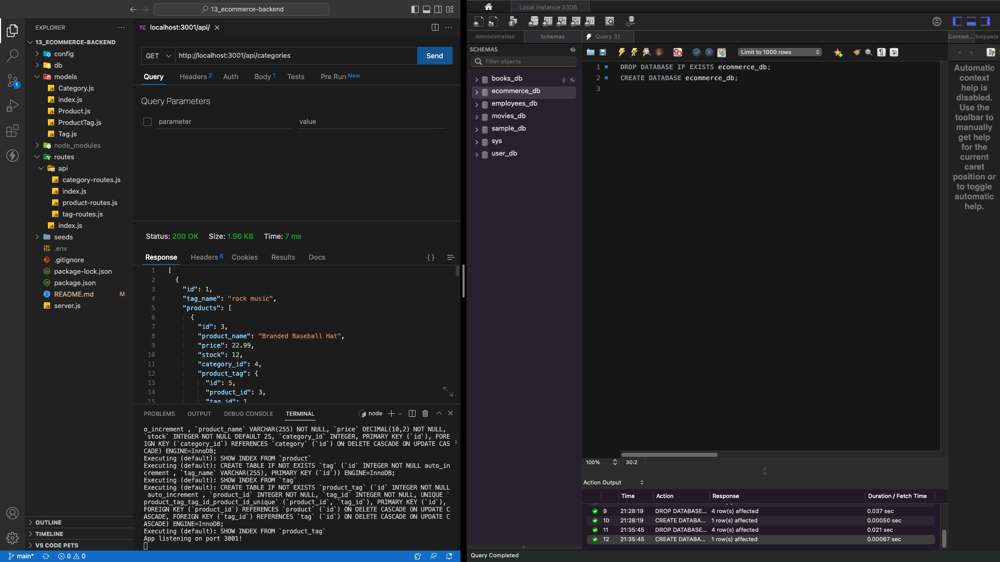

# Willy B's ECommerce | Backend

This is my first challenge using ORM via Sequelize.

Creating the api routes and models for Category, Product and Tag variables took the most time while completing this debugging challenge. I learned a lot about ways to manage data based on .then and .catch commands. The combination of Express, Node.js and MySQL made the syntax a lot more digestible. Learning how to differentiate between singular and plural variables also proved to be a good exercise for future explorations within the MVC pattern.

As specified in the Challenge Acceptance Criteria, the backend of this ecommerce platform achieves the following:

✨ I am able to connect to a database using Sequelize.

✨ A development database is created and is seeded with test data.

✨ My server starts and the Sequelize models are synced to the MySQL database.

✨ The data for each designated route (Category, Product & Tag) is displayed in a formatted JSON.

✨ I am able to successfully create, update, and delete data in my database.

Below is a screenshot of my latest and greatest:

To view my video demo, click [here](https://drive.google.com/file/d/1cKIeBl8flK-9b4GPPpaAgr9ywXNGfo23/view?usp=sharing).
